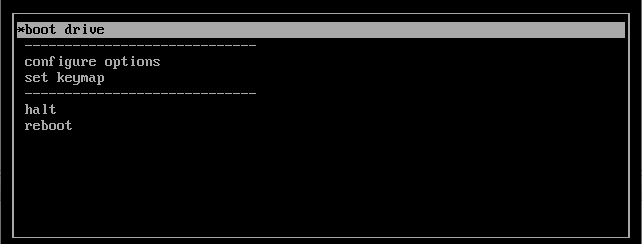
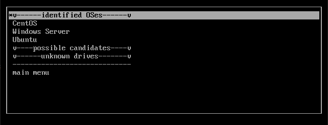
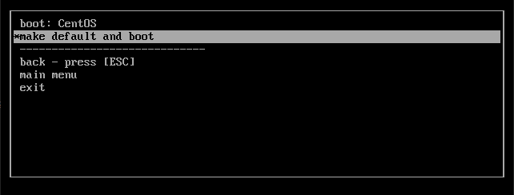
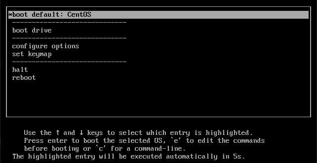
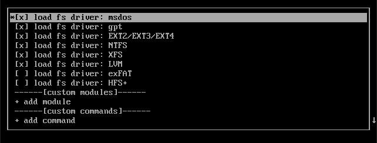

# auto chain grub
A scripted GRUB for easy and automatic chainloading of disks (not partitions!). *EFI- and secure-boot supported.*

### why?
I needed an easy way to multiboot server operating systems and distros on different disks or RAID-volumes. Most server OSes or distros do not allow for automatic multibooting (configuring grub/sylinux right); and if they do, if volumes are removed or erased, bootloader configurations do not update automatically. This GRUB "variant" is intended to be a system wide first bootloader, residing on an SD-card or USB-drive.

Requirements:
* chainload volumes with their own bootloader
* detect bootable volumes and OSes
* automatic update of boot options
* store default boot option
* show defined behavior when removing or erasing volumes

## using
Write the `.img` file produced by the build to a drive - using `dd` or your favorite tool - and set the drive as first boot device. You may as well try to use the `.iso` image and write it using e.g. rufus. For testing, a `.vhd` and `.vhdx` image are provided.

### OS booting
select *boot drive*



OSes or bootable disks will be detected



Select a disk (OS) to boot from and optionally set as default boot option



#### booting default selection
A disk/OS selected as default boot option will boot automatically after a (configurable) timeout. If the disk has been removed, further booting is stopped and the main menu is shown.



## configuration
A set of default modules can be de-/activated in the `configure options` menu. Custom modules and custom commands to execute before loading the main menu can be configured as well. Options are saved and persisted in grubenv.



### OS detection
Following OSes should be detected
* esxi
* Debian generic
* Ubuntu
* Arch
* xcp-ng
* CentOS
* XenServer
* Windows Server
* Windows 10
* Windows 8
* Windows NT + (likely 7)

*(for heuristics, see [./notes/heuristics.md](./notes/heuristics.md))*

### Bootloader & EFI detection
Detected bootloaders are, in different installation locations.
* syslinux
* GRUB

*(for heuristics, see [./notes/heuristics.md](./notes/heuristics.md))*

If GRUB is run in EFI mode, it searches for a partition including bootable EFI-images


## building
Build and run the docker container. Container has to be run using `--privileged` as mounting of loopback devices must be possible to create disk images. Mount the repositories root to the container (example mounts at `/grub`).
``` 
docker build --tag grub-builder .
docker create -v $(pwd):/grub/ -w /grub/ --name grub-builder --privileged -it grub-builder bash
``` 
Run and attach to the container, change terminal to repository root in container and:
```
./make.sh
```
Building will produce following artifacts:
* `.iso`-file: Bootable iso created by `grub-mkrescue`
* `.img`-file: Raw disk image with partitions for MBR- and EFI-booting
* `.vhd`-file: *virtual disk from the raw image*
* `.vhdx`-file: *virtual disk from the raw image*

## customization
You may customize the build by adding/enabling *default* options or adding keymaps in `make.sh`. You may as well configure the timeout for the default boot option while building.
Default boot option timeout can be modified from a live installation, using `set timeout=<seconds>; save_env timeout`.
Loading custom modules, or adding custom commands to execute before loading, can be done in the `configure options` menu.

## GRUB scripts
For anybody who wants to script their own flavour of GRUB, the `functions.cfg` in `disk/boot/grub` includes some neat functions, including:
* file-path manipulation
* string manipulation
* list operations
* code execution based on variable state
* "safe" testing for bool values of variables
* random string/char generator

## info
booting ISO images is prepared, but not useable per now

*Licensed unter MPL v2.0. Copyright (C) 2020 Arne Wendt*